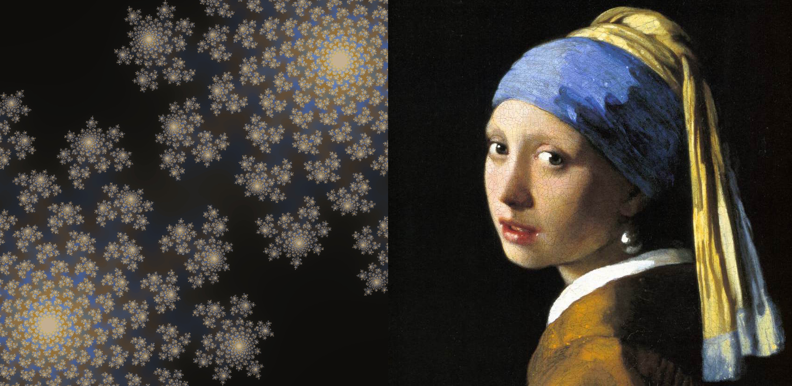

```@meta
DocTestSetup = quote
    using ColorSchemes, Colors
end
```
# Images

## Saving colorschemes as images

Sometimes you want to save a colorscheme, which is usually just a pixel thick, as a swatch or image. You can do this with `colorscheme_to_image()`. The second argument is the number of repetitions of each color in the row, the third is the total number of rows. The function returns an image which you can save using FileIO's `save()`:

```
using FileIO, ColorSchemes, Images, Colors

img = colorscheme_to_image(ColorSchemes.vermeer, 150, 20)
save("/tmp/cs_vermeer-150-20.png", img)
```


The `image_to_swatch()` function extracts a colorscheme from the image in and saves it as a swatch in a PNG.

```@docs
colorscheme_to_image
image_to_swatch
```

#### Colorschemes to text files ###

You can save a colorscheme as a text file with the imaginatively-titled `colorscheme_to_text()` function.

```
colorscheme_to_text(ColorSchemes.vermeer, "the_lost_vermeer", "/tmp/the_lost_vermeer.jl")
```

The file is basically a Julia source file with the color values preceded by a valid symbol name and the `@reg` macro. When this file is loaded into Julia (using `include()`), the scheme is added at the end of the list of available schemes in `schemes`.

    # created 2018-08-28T19:50:52.395
    @reg the_lost_vermeer [
    RGB{Float64}(0.045319841827409044,0.04074539053177987,0.033174030819406126),
    RGB{Float64}(0.06194243196273512,0.05903050212040492,0.05139710689483695),
    RGB{Float64}(0.08816176863597491,0.0835588842566198,0.07360482587419233),
    ...
    RGB{Float64}(0.9481923826365111,0.8763149891872409,0.5495049783744819),
    RGB{Float64}(0.9564577470648753,0.8846308778140886,0.7723396650326797),
    RGB{Float64}(0.9689316860465117,0.9673077588593577,0.9478145764119602) ]

```@docs
colorscheme_to_text
@reg
```

## A Julia Julia set: colorschemes and Images

Here's how you can use colorschemes when creating images with Images.jl. The code creates a Julia set and uses a colorscheme extracted from Vermeer's painting "Girl with a Pearl Earring" (shown at the right).



```
using ColorSchemes, Images

function julia(z, c, maxiter::Int64)
    for n = 1:maxiter
        if abs(z) > 2
            return n
        end
        z = z^2 + c
    end
    return maxiter
end

# convert a value between oldmin/oldmax to equivalent value between newmin/newmax
remap(value, oldmin, oldmax, newmin, newmax) = ((value - oldmin) / (oldmax - oldmin)) * (newmax - newmin) + newmin

function draw(c, imsize;
      xmin = -1, ymin = -1, xmax  =  1, ymax = 1,
      filename = "/tmp/julia-set.png")
    imOutput = zeros(RGB{Float32}, imsize, imsize)
    maxiterations = 200
    for col = range(xmin, stop=xmax, length=imsize)
        for row = range(ymin, stop=ymax, length=imsize)
            pixelcolor = julia(complex(row, col), c, maxiterations) / 256
            xpos = convert(Int, round(remap(col, xmin, xmax, 1, imsize)))
            ypos = convert(Int, round(remap(row, ymin, ymax, 1, imsize)))
            imOutput[xpos, ypos] = get(ColorSchemes.vermeer, pixelcolor)
        end
    end
    FileIO.save(filename, imOutput)
end

draw(-0.4 + 0.6im, 1200)
```
