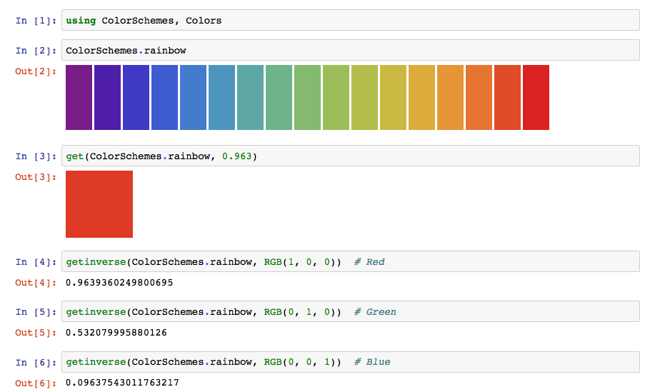
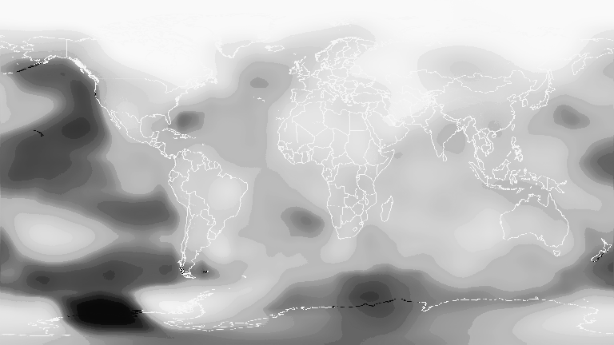
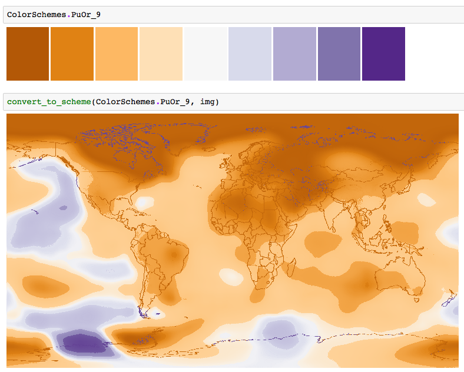

# Finding colors in colorschemes

ColorSchemes.jl provides a function, `getinverse(cscheme, c)`, which is the inverse of `get(cscheme, x)`.

This function places a color within a colorscheme by converting the color to a value representing its position on the colorscheme's axis.



## Example

One way to use `getinverse()` is to convert a heatmap image into an Array of continuous values, e.g. temperature.

In this example, we will convert a heatmap image representing elevation in the United States into an Array of elevation values.

```
using Images, FileIO
img = download("https://www.nasa.gov/images/content/719282main_2008_2012_printdata.1462.jpg") |> load
img = imresize(img, Tuple(Int(x) for x in size(img) .* 0.2));
display(img)
```


```
temps = [getinverse(ColorSchemes.temperaturemap, pixel) for pixel in img]

432×768 Array{Float64,2}:
 0.975615  0.975615  0.975615  0.975615  …  0.975615  0.975615  0.975615
 0.975484  0.975767  0.975615  0.975615     0.975615  0.975615  0.975767
 0.975615  0.975615  0.975615  0.975615     0.975615  0.975615  0.975615
 0.975615  0.975615  0.975615  0.975615     0.975615  0.975615  0.975615
 0.975615  0.975615  0.975615  0.975615     0.975615  0.975615  0.975615
 0.975615  0.975615  0.975615  0.975615  …  0.975615  0.975615  0.975615
 0.975615  0.975615  0.975615  0.975615     0.975615  0.975615  0.975615
 0.975615  0.975615  0.975615  0.975615     0.975615  0.975615  0.975615
 0.975615  0.975615  0.975615  0.975615     0.975615  0.975615  0.975615
 0.975615  0.975615  0.975615  0.975615     0.975615  0.975615  0.975615
 0.975615  0.975615  0.975615  0.975615  …  0.975615  0.975615  0.975615
 0.975615  0.975615  0.975615  0.975615     0.975899  0.975899  0.975615
 0.975615  0.975615  0.975615  0.975615     0.975739  0.975739  0.975899
 ⋮                                       ⋱  ⋮                           
 0.84482   0.844684  0.84482   0.821402  …  0.845689  0.846855  0.84482
 0.823358  0.823887  0.823887  0.823536     0.822783  0.823358  0.823358
 0.822956  0.822359  0.821921  0.82257      0.823536  0.823536  0.823996
 0.821989  0.822677  0.821949  0.821949     0.823141  0.824371  0.822677
 0.820419  0.820084  0.819388  0.819388     0.819977  0.821949  0.81973
 0.816596  0.816055  0.816055  0.816055  …  0.819388  0.819388  0.818957
 0.813865  0.813247  0.813247  0.813247     0.816055  0.815452  0.813865
 0.810015  0.809307  0.809307  0.809307     0.813247  0.812582  0.812582
 0.808566  0.805171  0.805171  0.805171     0.810015  0.810015  0.809307
 0.804418  0.801045  0.80182   0.801045     0.805171  0.805171  0.805171
 0.801045  0.802513  0.802513  0.800252  …  0.804418  0.804308  0.801045
 0.802037  0.798624  0.798624  0.798624     0.802401  0.800252  0.802848
```

```
mintemp,maxtemp = ind2sub(temps, indmin(temps)), ind2sub(temps, indmax(temps))

((397, 127), (17, 314))

```

```
Gray.(temps)
```



## Convert to scheme


Using `getinverse()` it's easy to convert an image from one colorscheme to another.

`convert_to_scheme(cscheme, img)` returns a new image in which each pixel from the provided image is mapped to its closest matching color in the provided scheme.

```
convert_to_scheme(vcat(ColorSchemes.coffee, RGB(0,0,0)), img)
```



```@docs
getinverse
convert_to_scheme
```
