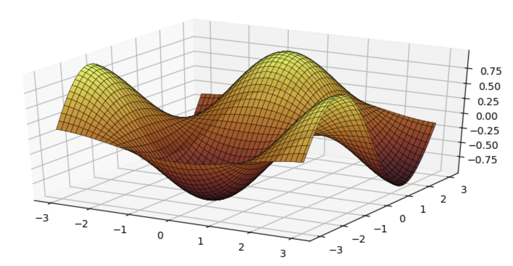

# Plotting

## Plots.jl

Tom Breloff's amazing superplotting package, [Plots.jl](https://github.com/tbreloff/Plots.jl) can use colorschemes.

With the `contour()` function, use `cgrad()` to read the colorscheme as a gradient. This renaissance-looking plot uses the `leonardo` scheme:

    using Plots, Colorschemes

    x = 1:0.3:20
    y = x
    f(x,y) = begin
          sin(x) + cos(y)
      end
    contour(x, y, f, fill=true, seriescolor=cgrad(ColorSchemes.leonardo))

(You can use `c` as a short cut for `seriescolor`.)

With other plots, use the `palette` keyword:

    plot(Plots.fakedata(100, 20),
        w=4,
        background_color=ColorSchemes.vermeer[1],
        palette=ColorSchemes.vermeer)

You can list all colorschemes with a set of PyPlot heatmap plots:

    pyplot()
    z = (1:10)*(1:33)'
    map(cs -> PlotUtils.register_gradient_colors(Symbol(cs), eval(ColorSchemes, cs)), schemes);
    cschemes = keys(PlotUtils._gradients)
    plot([heatmap(z,fc=cm,leg=false,title=cm,ticks=nothing, titlefont = font(8)) for cm=cschemes]..., size=(1500,1500))

## Gadfly

Here's how you can use ColorSchemes in Gadfly:

    x = repeat(collect(1:20), inner=[20])
    y = repeat(collect(1:20), outer=[20])
    plot(x=x, y=y,
        color=x+y,
        Geom.rectbin,
        Scale.ContinuousColorScale(p -> get(ColorSchemes.sunset, p)))

## Winston

If you prefer Winston.jl for plotting, you can use colorschemes with `imagesc`:

    using Winston
    klimt = ColorSchemes.klimt
    Winston.colormap(klimt)
    Winston.imagesc(reshape(1:10000,100,100))

Sometimes you'll want a smoother gradient with more colors. You can use `get(scheme, n)` to generate a more detailed array of colors, varying `n` from 0 to 1 by 0.001:

    brasstones = ColorSchemes.brass
    brasstonesmooth = [get(brasstones, i) for i in 0:0.001:1]
    Winston.colormap(brasstonesmooth)
    Winston.imagesc(reshape(1:10000,100,100))

## PyPlot

Colorschemes can be used with the `cmap` keyword in PyPlot:

    using PyPlot, Distributions

    solar = ColorSchemes.solar

    n = 100
    x = linspace(-3, 3, n)
    y = linspace(-3,3,n)

    xgrid = repmat(x',n,1)
    ygrid = repmat(y,1,n)
    z = zeros(n,n)

    for i in 1:n
        for j in 1:n
            z[i:i,j:j] = pdf(MvNormal(eye(2)),[x[i];y[j]])
        end
    end

    fig = PyPlot.figure("pyplot_surfaceplot",figsize=(10,10))
    ax = fig[:add_subplot](2,1,1, projection = "3d")
    ax[:plot_surface](xgrid, ygrid, z, rstride=2,edgecolors="k",
        cstride=2,
        cmap=ColorMap(solar),
        alpha=0.8,
        linewidth=0.25)

